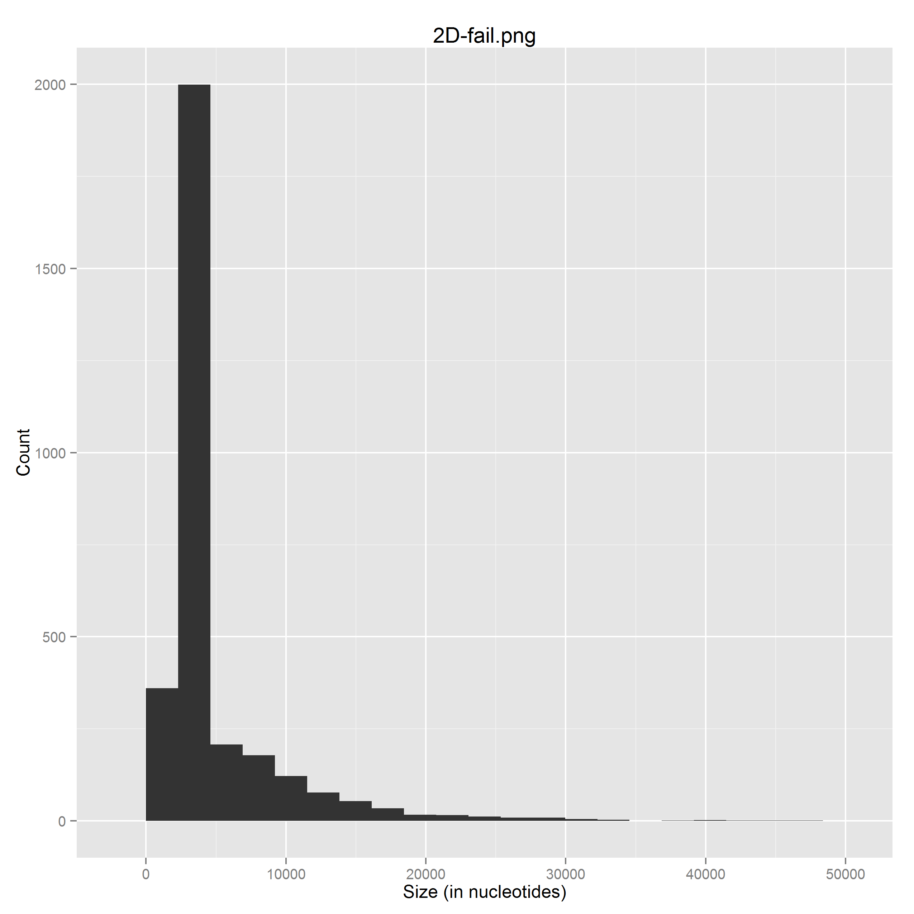
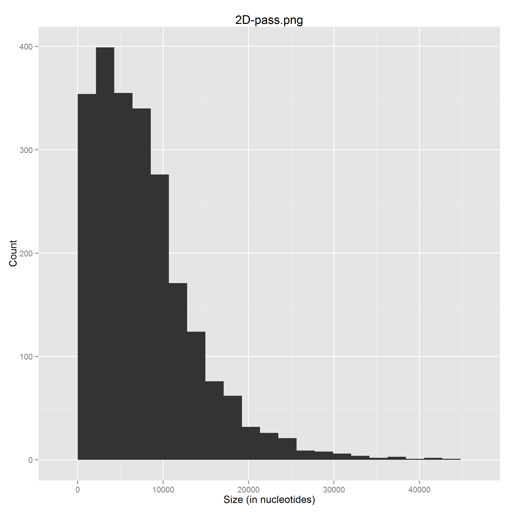

#Assignment 3
##QC and alignment
1. EDIT
Statistics on 1D vs 2D reads in Pass and Fail
 * Number of 2D reads classified as 'failed' = 2272 
 * Number of 2D reads classified as 'passed' = 3109
 * % of reads that are 2D in 'pass' folder = 42%
  * % of reads that are 2D in 'fail' folder = 

2. 
   Active Channels =  78

   Average reads per channel =  15.2564102564

   Channel 224 has most reads with 81 reads
   
   `$ python group5_assignment3_question2.py fastq/2D-fail.fastq fastq/2D-pass.fastq fastq/1D-fail.fastq fastq/1D-pass.fastq`

3. EDIT

   Plot Cummulative Distribution of Nucleotides over Time (hours)

   **Cummulative Distribution of Nucleotide reads, passed**
   
   `$ poretools yield_plot --plot-type basepairs pass`

   

   **Cummulative Distribution of Nucleotide reads, passed**
   
   `$ poretools yield_plot --plot-type basepairs pass`

   

4. 
   **Length distribution of 2D reads, failed**
   
   `$ python group5_assignment3_question4.py fastq/2D-fail.fastq 2D-fail.png`
   
   
   
   **Length distribution of 2D reads, passed**
   
   `$ python group5_assignment3_question4.py fastq/2D-pass.fastq 2D-pass.png`
   
   
   
5. Longest reads:

   | 2D | Nucleotides |
   | --- | --- | 
   | Passed |32460 |
   | Failed | 26447 |
   
   `$ python group5_assignment3_question5.py fastq/2D-pass.fastq`
   
   `$ python group5_assignment3_question5.py fastq/2D-fail.fastq`
   
6. 
7. EDIT

8. EDIT - Three Strategis to Reduce the Number of Errors in the Reads
I) Greedy Algorithm - Check for highly interoperable regions
	Fill in based on many reference reads
II) Cross-Reference overlapping reads
III) Plotting frequency of alignments at positions
	-Should have a uniform distribution
IV) Map regions that map to highly variable regions 
	-Exclude regions that only align to highly variable regions
	-Mask areas of the genome that we are uncertain about

