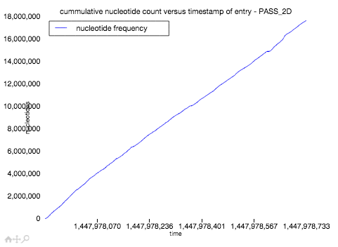
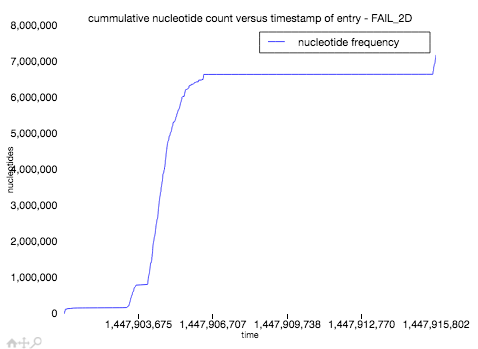
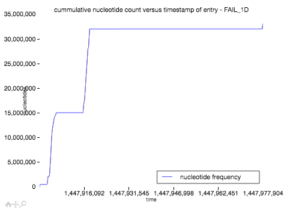

#Assignment 3
##QC and alignment

Group 5: Brian Trippe (blt2114), David Streid (dcs2153), Diego Paris (drp2121), Katie Lin (kl2532)
 

1. 
Statistics on 1D vs 2D reads in Pass and Fail
 * Number of 2D reads classified as 'failed' = 3109
 * Number of 2D reads classified as 'passed' = 2272
 * % of 2D reads that are 'Failed' = 42%
 * % of 2D reads that are 'Pass' = 100%
 
 `group5_report1_question1.sh`

2. 
   Active Channels =  216

   Average reads per channel =  24.912037037

   Channel 224 has most reads with 123 reads
   
   `$ python group5_assignment3_question2.py fastq/2D-fail.fastq fastq/2D-pass.fastq fastq/1D-fail.fastq fastq/1D-pass.fastq`

3. 

   Plot Cummulative Distribution of Nucleotides over Time (hours)

   **Cummulative Distribution of Nucleotide reads, 2d passed**

   

   **Cummulative Distribution of Nucleotide reads, 2d failed**

   

   **Cummulative Distribution of Nucleotide reads, 1d failed**

   

   **Cummulative Distribution of Nucleotide reads, 1d failed**
   
   There are no 1D pass reads
   
   `question3/group5_assignment3_question3.ipynb`

4. 
   **Length distribution of 2D reads, failed**
   
   `$ python group5_assignment3_question4.py fastq/2D-fail.fastq 2D-fail.png`
   
   
   
   **Length distribution of 2D reads, passed**
   
   `$ python group5_assignment3_question4.py fastq/2D-pass.fastq 2D-pass.png`
   
   
   
5. Longest reads:

   | 2D | Nucleotides |
   | --- | --- | 
   | Passed |42974 |
   | Failed | 46250 |
   
   `$ python group5_assignment3_question5.py fastq/2D-pass.fastq`
   
   `$ python group5_assignment3_question5.py fastq/2D-fail.fastq`
   
6. Workflow was as follows (After calling "poretools fastq --type 2D ." on the 'pass' folder to obtain fastq file):
  1. Align reads
     ``bwa mem -x ont2d ref.fasta reads.fastq > aln1.sam``

  1. Creates .bam file from .sam
 ``samtools view -b -S -o aln1.bam aln1.sam``

  1. Creates aln1sorted.bam (ordered by chromosome)
 ``samtools sort aln1.bam aln1sorted``

  1. Creates bcf (can use sorted bam too)
 ``samtools mpileup -uf h19.fasta aln1sorted.bam > aln1.bcf``

  So 0x904 is equivalent to 2308 in base 10. This means that bits 4 (unmapped), 256 (secondary alignment), and 2048 (supplementary alignment) are set  and the "-F" option to samtools view then indicates that any record with one of these bits set is to be ignored.  This returns the number of reads aligned.
 ``samtools view -F 0x904 -c aln1sorted.bam``

 That number is 2091 reads aligned. There were 2272 reads in the fastq file run through bwa mem.

1. Used [tutorial](http://biobits.org/samtools_primer.html) for instruction on using samtools.

 Confusion Matrix
  - Columns are reference
  - Rows are calls

 | Nucleotide | A | C | T | G |
 | --- | --- | --- | --- | --- |
 | A | 264985 | 1200 | 1159 | 1741 |
 | C | 2587 | 174292 | 2758 | 1731 |
 | T | 1158 | 1787 | 268059 | 1127 |
 | G | 2653 | 1772 | 2431 | 175448 |

updated subsitution matrix:

 | Nucleotide | A | C | T | G | Del |
 | --- | --- | --- | --- | --- | --- |
 | A | 364290 | 3459 | 1618 | 3591 | 10947 |
 | C | 1691 | 246343 | 2550 | 2505 | 6171 |
 | T | 1576 | 3743 | 365034 | 3290 | 18011 |
 | G | 2443 | 2466 | 1591 | 246612 | 6213 |
 | Ins | 7596 | 8785 | 10782 | 9589 | N/A |

 Only a subset of aligned bases were used to produce this matrix as the distribution seemed to converge after an even smaller number of aligned bases.
 All indels were ignored for this.

8. Strategies to Reduce the Number of Errors in the Reads

  * Imputations as discussed in class could be used to replace low quality calls, reducing the error rate. 

  * The process would be to extract high-quality SNPs from the aligned reads and use them to find the most likely calls for misaligned areas of the aligned reads.
This would require access to a large database of already-sequenced human genomes that could provide the most likely context for the high-quality SNPs.
Backtracking to find the 'better' calls via imputation might improve MinION base-calling overall if more profiling of the errors could be done.
Even lower quality SNPs, if imputation yields a result mostly agreeing with the SNP's context, could be used for imputation.

  * Ignoring alignments to error-prone regions would also reduce error rate. These may be specific to Oxford Nanopore technology.
If enough reads from different samples using MinIONs were aligned, a distribution of errors across the human genome could be found.
This distribution would be expected to be uniform, but there will likely by systematic errors that skew the data in certain regions, perhaps regions with high GC count, given what we already know about MinION.
Ignoring alignments to these regions would reduce the error rate in addition to the overall number of errors, although there would also be some data loss as a result.

  * Since the beginnings and ends of reads are known to be more error-prone than the middle, a certain number of bases from the beginning and ends of reads could be trimmed before alignment.
This may allow more reads to be successfully aligned, and may decrease the error rate.
There would be a lot of data loss, but imputation could mitigate that problem.
Metrichor's base-calling likely already takes this into account, but that may only make the 'edge' areas of reads more prone to systematic error issues.

  * Cross-Referencing overlapping reads would also help accuracy, but given our low number of reads, multiple overlaps along the genome are unlikely.
For larger read sets, this could help.
