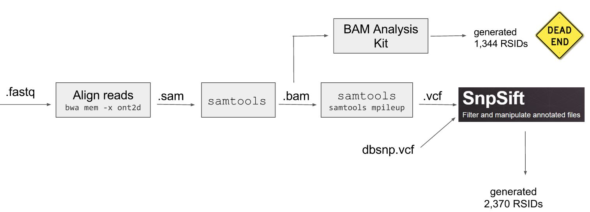
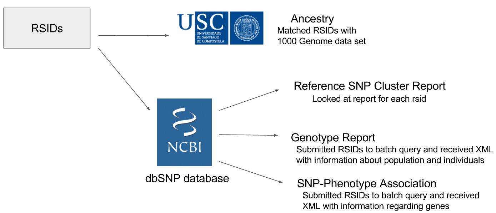
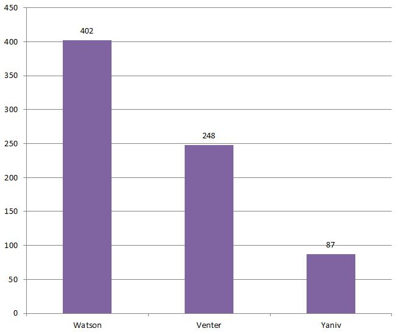
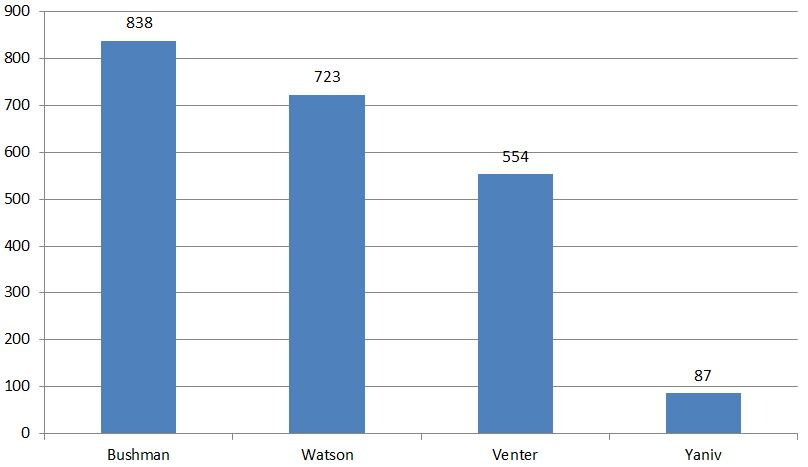
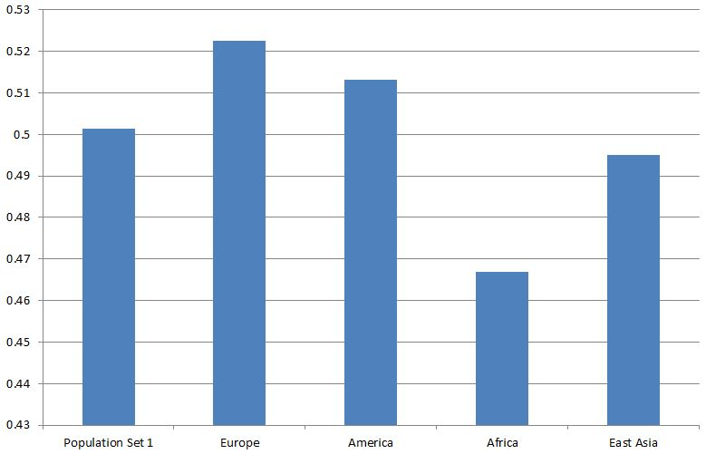

# Assignment 4
## Findings

Group 5: Brian Trippe (blt2114), David Streid (dcs2153), Diego Paris (drp2121), Katie Lin (kl2532)

### MinIon Sequencer Information

 Comparing our sequencer output to the previous Hackathon, we see that the average reads per channel is much less. This may be attributed to longer reads, which would lead to fewer reads per channel.

|                           | What did Sophie eat?                     | CSI Columbia                              |
|---------------------------|:----------------------------------------:|:-----------------------------------------:|
| Active Channels           | 251                                      | 216                                       |
| Average reads per channel | 101.25498008                             | 24.912037037                              |
|                           | Channel 90 has most reads with 449 reads | Channel 224 has most reads with 123 reads |

#### Statistics regarding *2D reads*:

|        | Total # of Reads | Longest Read (bp) |
|--------|------------------|-------------------|
| Passed | 2,272 (42%)      | 42,974            |
| Failed | 3,109 (58%)      | 46,250            |

#### Alignment to hg19 using BWA-MEM ONT

 2,091 reads aligned (92%) out of 2,272 2D passed reads

#### Substitution matrix:

| Nucleotide | A | C | T | G | Del |
| --- | --- | --- | --- | --- | --- |
| A | 364290 | 3459 | 1618 | 3591 | 10947 |
| C | 1691 | 246343 | 2550 | 2505 | 6171 |
| T | 1576 | 3743 | 365034 | 3290 | 18011 |
| G | 2443 | 2466 | 1591 | 246612 | 6213 |
| Ins | 7596 | 8785 | 10782 | 9589 | N/A |

### Analysis Pipeline

 1. Align reads `bwa mem -x ont2d ref.fasta reads.fastq > aln1.sam`
 2. Creates .bam file from .sam `samtools view -b -S -o aln1.bam aln1.sam`
 3. Creates aln1sorted.bam (ordered by chromosome) `samtools sort aln1.bam aln1sorted`
 4. Creates bcf (can use sorted bam too) `samtools mpileup -uf h19.fasta aln1sorted.bam > aln1.bcf`
 
 Determined 2,091 reads aligned (92%) out of 2,272 2D passed reads.
 5. Generate RSIDs

     To generate RSIDs, we had 2 approaches:

       A. *BAM Analysis Kit* generated 1,344 RSIDs

       B. `samtools` generated 2,370 RSIDs

      At first, we used the BAM Analysis Kit's generated RSIDs to perform our analysis. We wanted to check the RSIDs using `samtools` as a verification method but it generated RSIDs that were disjoint from BAM Analysis Kit's. We decided to use the RSIDs from `samtools` for the following reasons:
        * Double the number of RSIDs 
          * 2,370 (samtools) vs. 1,344 (BAM analysis kit)
        * ~10x more hits on potential candidates
        * Better Documentation

 6. Use RSIDs to find more information about individual

 
 

  With the RSIDs, we used the following resources:
  * SPSmart
    * Ancestry
      * Matched RSIDs with 1000 Genome data set

  * NCBI dbSNP database
    * Reference SNP Cluster Report
      * Looked at report for each rsid
    * Genotype Report
      * Submitted RSIDs via batch query and received XML with information about population and individuals
    * SNP-Phenotype Association 
      * Submitted RSIDs via batch query and received XML with information regarding genes

### Comparing Genomes

|                | Yaniv Erlich | James Watson (NCBI ftp file) | James Watson (NCBI dbSNP Genomic Report) | Craig Venter (Venter Institute ftp file) | Craig Venter (NCBI dbSNP Genomic Report) | 1000 Genomes |
|----------------|--------------|------------------------------|------------------------------------------|------------------------------------------|------------------------------------------|--------------|
| RSID matches   | 87           | 402                          | 723                                      | 248                                      | 554                                      | 0            |
| RSIDs reported | 960,614      | 2,060,544                    | Unknown                                  | 4,017,989 ssids                          | Unknown                                  | N/A          |

 Notes:

   * Yaniv Erlich's RSIDs restricted to 23andMe assay
   * James Watson: NCBI ftp file
   * Craig Venter: Venter Institute ftp file
   * NCBI Genomic Report generated from [here] (http://www.ncbi.nlm.nih.gov/projects/SNP/dbSNP.cgi?list=rslist)
     * 1000 Genomes is included in NCBI report as population categories (i.e. EUR, AFR, AMR) but individuals are not included

#### Comparison using ftp files

|                | Watson    | Venter    | Erlich  |
|----------------|-----------|-----------|---------|
| matches        | 402       | 248       | 87      |
| RSIDs reported | 2,060,544 | 4,017,989 | 960,614 |

#### Comparison using NCBI dbSNP Genomic Report

|         | Bushman KB1 | Watson | Venter | Erlich |
|---------|-------------|--------|--------|--------|
| matches | 838         | 723    | 554    | 87     |

It is interesting to note that Bushman KB1 was the individual with the greatest number of matching alleles compared to our sample. However, we can eliminate him because based on the 1000 Genomes, our individual is most likely of European descent.

#### Identifying 

Only looking at Erlich, Watson, and Venter, our best guess would be Watson. 

Keep in mind that:

  * 20,102,536 bases read
  * 14,681,244 bases aligned 
  * 31,170 variants
  * 2,370 rsids tagged SNPs

### Findings of Individual

#### SNPs on the mitochondria?

 None detected

 Reasons:

 * Mitochondrial Size is small, but high copy number
     * human genome 3.2 Gbp, copy number 2 (6.4 Gbp)
     * mitochondrial genome 16 Kbp, copy number ~100 (1.6 Mbp)
     * 1.6:6400 MtDNA:nDNA… that’s 1:4000!
 * MinIon Reads on every chromosome, none on MtDNA

#### Gender

Male

 * 10 reads on Y chromosome
 * 94 SNPs found on Y chromosome

 * Genes found:
     * SPATA9
       * Spermatogenesis
     * PATE3
       * prostate and testis expressed

#### Ancestry

 Using [SPSmart] (http://spsmart.cesga.es/), rsid matcher with 1000 Genomes dataset:

| Group            | Frequency allele from sample matched |
|------------------|--------------------------------------|
| Population Set 1 | 0.5012488888888882                   |
| Europe           | 0.5225288888888893                   |
| America          | 0.5131288888888886                   |
| Africa           | 0.4668466666666665                   |
| East Asia        | 0.4950622222222223                   |

 Num of matched rsids =  900

 Num of unmatched rsids =  1470

#### Phenotypic Traits

 High number of Exon rsids (3.65% of rsids) -- relative to background (1.1-1.4% of DNA exonic) -- but still not enough to be useful (only 49 rsids!)

 Exon rsids:

  * rs1421085 -- allele: C
      * Gene: FTO
          * (C;C) ~1.7x increased obesity risk
          * (C;T) ~1.3x increased obesity risk

#### Diseases

| rsid        | Gene     | Allele | Description                                                    |
|-------------|----------|--------|----------------------------------------------------------------|
| rs148226094 | SLC4A1AP | C      | Associated with lung cancer                                    |
| rs61421071  | ISG20    | C      | Associated with mast cell disease and malignant glioma (tumor) |
| rs2487303   | KIF26A   | G/A    | Associated with megacolon (abnormal dilation of the colon)     |
| rs375771024 | SLIT2    | A      | Associated with Crohn's colitis                                |
| rs238406    | ERCC2    | A      | Associated disease xeroderma pigmentosum, group d              |

 Information mapping rsid to gene generated from [NCBI XML(Full) report] (http://www.ncbi.nlm.nih.gov/projects/SNP/dbSNP.cgi?list=rslist)

 Further details about genes found at [GeneCards] (http://www.genecards.org/)

### Conclusions

Only looking at Erlich, Watson, and Venter, our best guess would be Watson. 

#### Information Usefulness

 * 73% of Bases aligned
 * 9% of Variants have RSID tags
 * ~2,000 rsids, ~500 expected by chance
 * Linkage disequilibrium reduces information gain
 * 659 reads have rsids 

We need approximately 11 bits of information

Average bits of information in snps is 0.21 bits (average entropy)

Could be possible! Only 50 snps would be needed.
